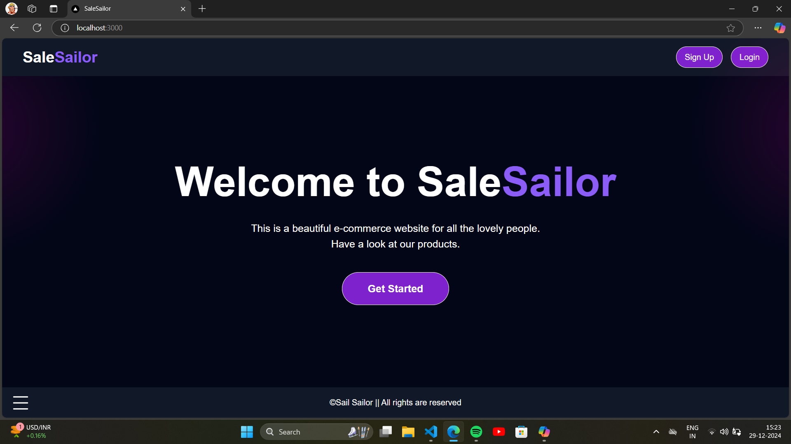
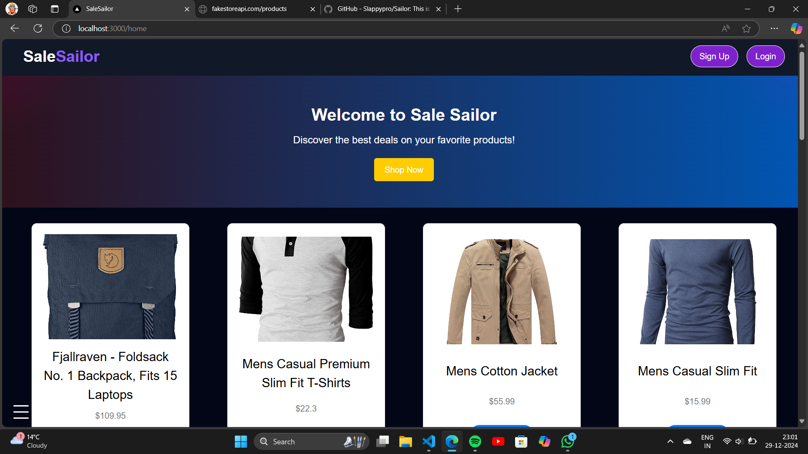
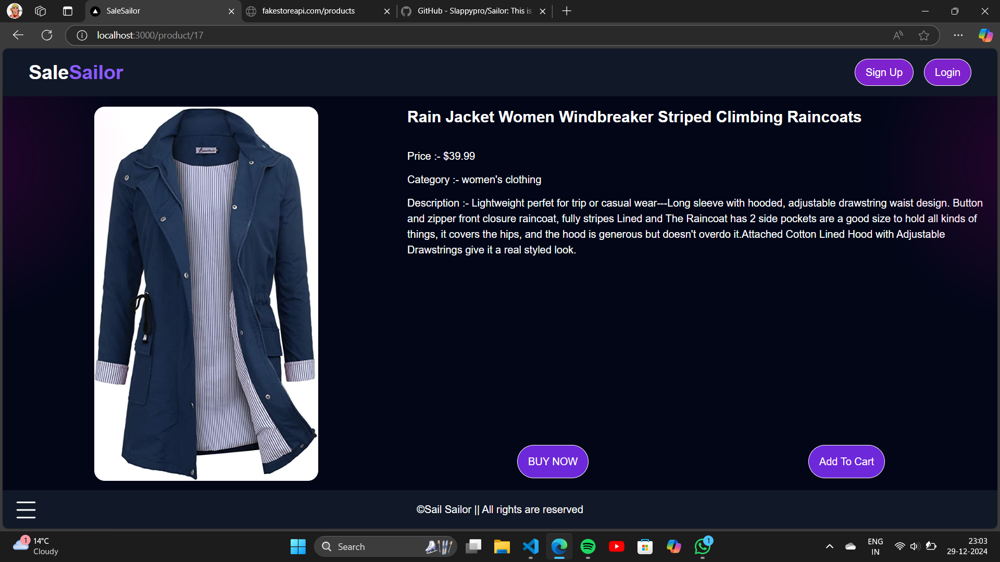

# SaleSailor
This is an E-commerce website 



# Home Page



# Product Page



# Demo
https://salesailor.vercel.app/

# Get it in your VS code

1. Choose a desired folder and initialize git in it by terminal using command:-
``` 
git init
```

2. Now clone this repo by using command :-
```
git clone https://github.com/Slappypro/Sailor.git
```

3. Go inside the new folder and inatall all packages by command :-
```
npm i
```

4. Finally to run this website in local server type command :- 
```
npm run dev
```

Now you can see it.